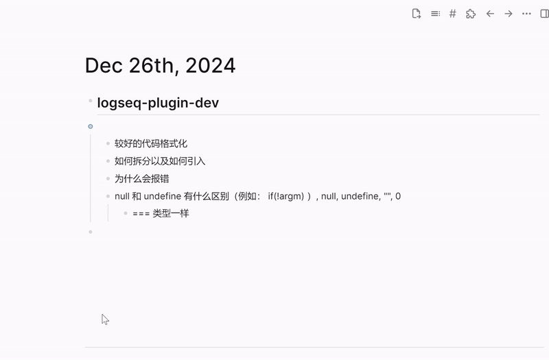

## Logseq ai tools

This is a tools for logseq :)

### Demo



### Usage

- `/ts` to trigger the command


### Configure item
- ai-address: ai server address. Ex.    http://127.0.0.1:5000
- ai-endpoint: ai endpoint. Ex.    /api/chat/completions
- ai-key: ai key. Ex.    sk-1234567890
- template: template for ai response

Example:
```
## 暴露公网IP #[[公网ip]]  
### 方法一 
使用如下网站 https://dashboard.cpolar.com/login  
### 方法二 
如果有公网ip的机器 使用隧道，可以参考 #[[ssh 隧道]]  

上面是我的一份日志，#[[公网ip]]是有关这份日志总结后提取出来的名词标签。现在你的任务是把总结下面的日志，并提取最多三个名词标签。标签的形式是#[[名词]]，多个标签用空格分隔。最后只输出文字，不要说明、不要解释。

${content}
```

### Build
1. Open dev model in logseq, then you can install plugin from disk.
2. Run: `npm install`
3. Run: `npm run build`

### git
`git clone git@github.com:tjlcast/logseq-ai-tools.git`

### Author
- [jialtang](https://github.com/tjlcast)